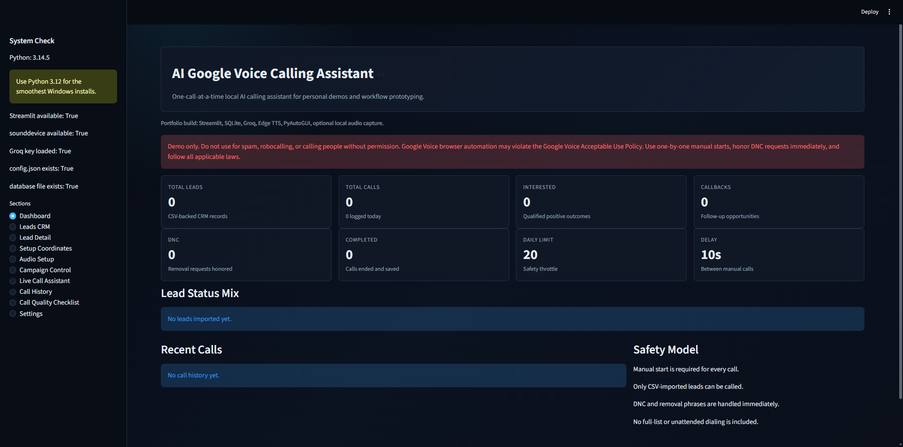
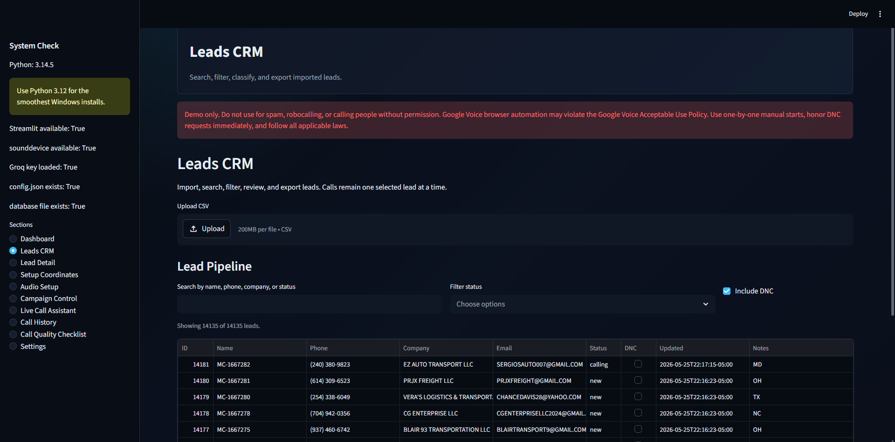
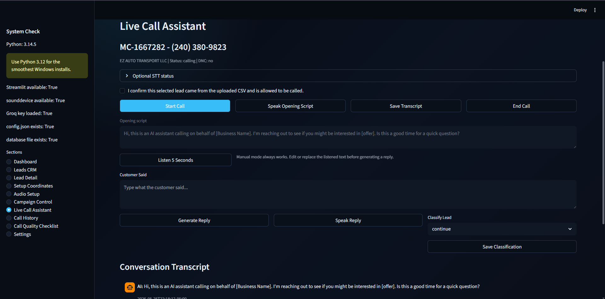

# AI Google Voice Agent

Portfolio-ready local Windows desktop AI calling assistant prototype built using Streamlit, Groq AI, PyAutoGUI, SQLite, Edge TTS, and Google Voice browser automation.

The project demonstrates:
- AI-generated sales conversations
- Human-supervised dialing workflow
- CRM-style lead management
- Coordinate-based browser automation
- Voice-assisted workflows
- Transcript and call history tracking
- Push-to-listen experimental audio support

> ⚠️ This project is a personal demo/testing prototype only.
> It is NOT a robocaller, spam dialer, or mass outbound calling system.

---

## Demo Preview

### Dashboard

### Leads CRM

### Live Call Assistant

---

## Features

- Professional dark Streamlit dashboard
- CRM lead management system
- Search and filter leads
- One-lead-at-a-time calling workflow
- Google Voice coordinate automation
- Groq AI response generation
- Edge TTS voice playback
- Transcript memory and chat history
- AI lead classification
- CSV import/export
- SQLite storage
- Safety controls and DNC handling
- Push-to-listen experimental mode
- Audio setup assistant
- Call analytics dashboard

---

## Project Status

Current version:
- ✅ Phase 1 Complete
- ✅ Phase 2 Complete
- ✅ Phase 3 Prototype Complete
- ⚠️ Experimental audio routing
- ⚠️ Semi-automatic workflow
- ⚠️ Prototype/demo quality only

---

## Tech Stack

- Python 3.12
- Streamlit
- SQLite
- Groq API
- Edge TTS
- PyAutoGUI
- SpeechRecognition
- sounddevice
- pandas
- pyperclip

---

## Limitations

- Google Voice has no official automation API
- Browser UI changes may break coordinates
- Audio routing depends on Windows setup
- Push-to-listen is experimental
- Not intended for production-scale calling
- Human supervision is required
